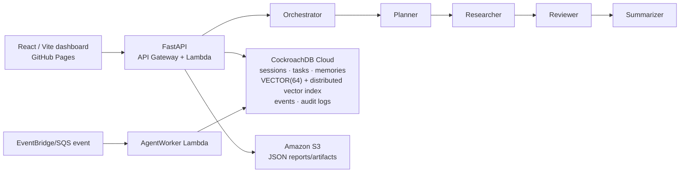

# MemoryGraph AI

Persistent, resumable multi-agent workspaces on **CockroachDB Cloud**. The app stores every session, task, memory, embedding, agent event, artifact, and audit entry in SQL; it then retrieves relevant memories with CockroachDB's distributed vector index. AWS Lambda runs durable agent jobs and Amazon S3 stores generated artifacts.

**Dashboard:** `https://denzasikora-lab.github.io/memorygraph-ai/` after the first successful Pages workflow. It is a real React client that calls the FastAPI endpoint—it does not ship hard-coded demo records.

## What works

- Five deterministic, no-key agents: Orchestrator → Planner → Researcher → Reviewer → Summarizer.
- Step-level persistence: stop a task, restart the app, search memory, resume at the next agent without re-running prior agents.
- `VECTOR(64)` embeddings, cosine `<=>` retrieval, deterministic tie breaking, and a CockroachDB vector index with `session_id` as the prefilter prefix.
- Pydantic v2 request validation, SQLAlchemy 2 models, Alembic migration, audit log, and artifact storage.
- Local Docker CockroachDB development; AWS SAM definition for API Gateway + Lambda + encrypted S3 bucket; GitHub Pages React deployment.

Mock embeddings are deterministic BLAKE2b projections for a free, reproducible MVP. Replace only the `embed()` implementation to use a production embedding model; the CockroachDB schema and retrieval query remain unchanged.

## Architecture



## Quick start

Requirements: Python 3.12, Node 22+, Docker, and (for cloud) CockroachDB Cloud plus AWS credentials.

```bash
cp .env.example .env
cd backend
python3 -m venv .venv
source .venv/bin/activate
pip install -e '.[dev]'
uvicorn app.main:app --reload
```

In a second terminal:

```bash
cd frontend
npm install
npm run dev
```

The dashboard opens at `http://localhost:5173`, proxies to FastAPI on `http://localhost:8000`, and uses a local SQLite file only for fast local tests. Production and all durable demo data must use CockroachDB; no other vector database or RDS is used.

## CockroachDB Cloud: `champ-dunnart`

1. Set `MEMORYGRAPH_DATABASE_URL` to the SSL connection string from the CockroachDB Cloud console. Do not add it to Git, GitHub variables, or this README.
2. Use the managed Cloud MCP server scoped to the supplied cluster ID. Add this to `~/.codex/config.toml` (the cluster ID is not a database password):

   ```toml
   [mcp_servers.cockroachdb-cloud]
   url = "https://cockroachlabs.cloud/mcp"
   http_headers = { "mcp-cluster-id" = "ab20e4f7-efb5-4502-9bf6-83568f3dae64" }
   ```

3. Authenticate with the safer OAuth flow:

   ```bash
   codex mcp login cockroachdb-cloud
   ```

4. In the MCP connection, enable vector indexes once as an admin:

   ```sql
   SET CLUSTER SETTING feature.vector_index.enabled = true;
   ```

5. Apply the real CockroachDB migration:

   ```bash
   cd backend
   alembic upgrade head
   ```

The migration uses the documented `CREATE VECTOR INDEX ... (session_id, embedding vector_cosine_ops)` syntax. Production semantic search uses `WHERE session_id = ... ORDER BY embedding <=> CAST(... AS VECTOR(64))`; this allows CockroachDB to use the distributed vector index.

CockroachDB references: [managed Cloud MCP server](https://www.cockroachlabs.com/docs/cockroachcloud/connect-to-the-cockroachdb-cloud-mcp-server) and [vector indexes](https://www.cockroachlabs.com/docs/stable/vector-indexes).

## Docker development

```bash
docker compose up --build
```

Before the first vector migration, enable `feature.vector_index.enabled` on the local cluster (or use the Cloud MCP instruction above):

```bash
docker compose exec cockroach cockroach sql --insecure -e 'SET CLUSTER SETTING feature.vector_index.enabled = true;'
```

Then restart the `api` service if the initial migration ran before the setting was enabled.

## AWS and public deployment

`template.yaml` defines:

- `ApiFunction`: API Gateway HTTP API → FastAPI Lambda.
- `AgentWorker`: a separate Lambda that handles one stored `task_id` agent step.
- `ArtifactBucket`: encrypted S3 storage; `AgentWorker` has only bucket write permission.

Deploy (AWS credentials required, never commit the connection URL):

```bash
sam build
sam deploy --guided
```

Use the resulting `ApiUrl` as the repository Actions variable `MEMORYGRAPH_API_URL`. Pushing `main` runs CI and `Deploy dashboard to GitHub Pages`, producing the public dashboard URL above. The Page can call only an HTTPS API endpoint; GitHub Pages cannot securely host the FastAPI database service itself.

## API example

```bash
curl -X POST http://localhost:8000/api/sessions -H 'content-type: application/json' -d '{"title":"Q3 launch"}'
curl -X POST http://localhost:8000/api/sessions/SESSION_ID/tasks -H 'content-type: application/json' -d '{"prompt":"Prepare a risk-aware launch plan"}'
curl -X POST http://localhost:8000/api/tasks/TASK_ID/run-step
curl -X POST http://localhost:8000/api/tasks/TASK_ID/stop
# Restart the app, then:
curl -X POST http://localhost:8000/api/tasks/TASK_ID/resume
curl 'http://localhost:8000/api/sessions/SESSION_ID/memories/search?query=launch%20risk'
```

## Verification

```bash
cd backend && pytest
cd frontend && npm run build
```

`tests/test_resume_flow.py` proves validation, semantic retrieval, stop/restart/resume behavior, and graph data. A live Cloud migration/smoke test is intentionally not run until the OAuth login and SQL connection string have been authorized.

## License

Apache-2.0. See [LICENSE](LICENSE).
