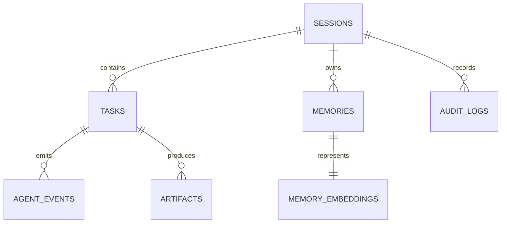

# MemoryGraph AI — implementation plan

## Outcome

MemoryGraph AI is a persistent, resumable multi-agent workspace. CockroachDB Cloud is the system of record for sessions, tasks, memories, vectors, events, artifacts, and audit logs. AWS Lambda can execute an agent step and Amazon S3 stores artifact payloads.

## MVP scope

1. Five deterministic agents: Orchestrator, Planner, Researcher, Reviewer, and Summarizer.
2. A persisted `next_agent_index` makes a stopped task resume from the next unfinished agent after an app restart.
3. Each agent step produces an event, memory, embedding, audit record, and report artifact.
4. Semantic lookup uses CockroachDB's distributed vector index in production and a deterministic cosine fallback for local SQLite tests.
5. A React dashboard drives the API; it is not a static mock-up.

## Data model

## CockroachDB design

- `memory_embeddings.embedding` is `VECTOR(64)`.
- The migration creates `CREATE VECTOR INDEX memory_embeddings_session_embedding_idx ON memory_embeddings (session_id, embedding vector_cosine_ops)`.
- Production retrieval constrains `session_id` and orders with `<=>`, matching the index prefix and cosine opclass.
- The database administrator enables `feature.vector_index.enabled`; the app never silently replaces CockroachDB with another vector store.

## Delivery sequence

1. Database models and Alembic migration.
2. API, deterministic embeddings, repository, mock agents, and restart/resume flow.
3. React dashboard and Docker local stack.
4. Lambda/S3 adapters and a GitHub Pages deployment workflow for the dashboard.
5. Tests, local verification, and a live Cloud smoke test after OAuth/database connectivity is authorized.

## Security boundaries

- No credentials are committed. `.env` is ignored and `.env.example` contains placeholders only.
- CockroachDB Cloud MCP is scoped to cluster `champ-dunnart` using the supplied cluster ID and should use OAuth (`codex mcp login cockroachdb-cloud`).
- S3 is only used when `MEMORYGRAPH_S3_BUCKET` is set and AWS credentials are supplied by the runtime.

## Deferred from this pass

- Demo video and generated images, by request.
- Public Pages URL verification until code is pushed and GitHub Pages finishes its first deployment.
